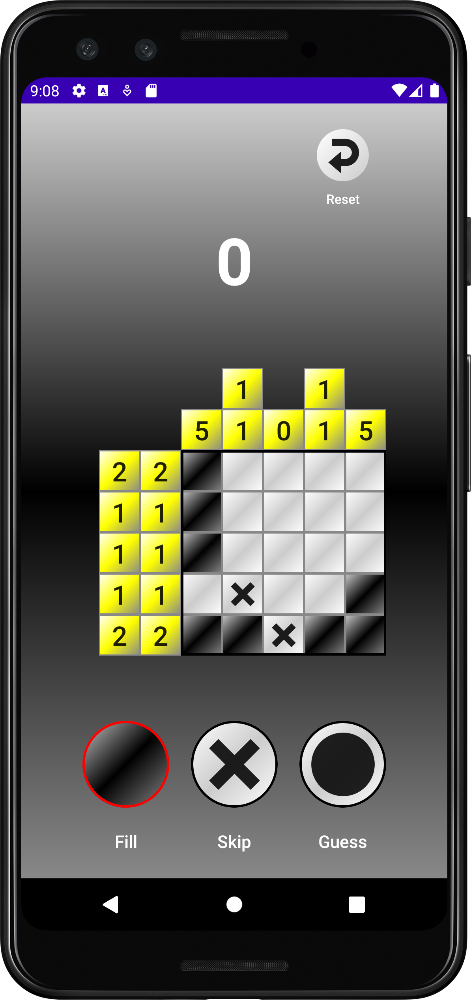

# Nonogram
A simple nonogram puzzle app built with Jetpack Compose. Nonograms are a Japanese logic puzzle where cells on the grid must be filled in or left black according to the numbers in the rows and columns adjacent to the main grid.

Libraries used include:  
Jetpack Compose  
Jetpack Navigation  
DataStore  
Google Accompanist  
Hilt  
JUnit  
Google Truth  

